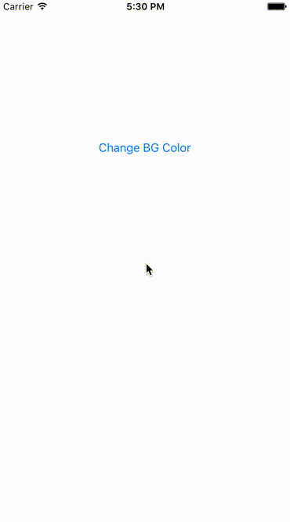

# RappleColorPicker

[](https://travis-ci.org/Rajeev Prasad/RappleColorPicker)
[](http://cocoapods.org/pods/RappleColorPicker)
[](http://cocoapods.org/pods/RappleColorPicker)
[](http://cocoapods.org/pods/RappleColorPicker)

## Usage

To run the example project, clone the repo, and run `pod install` from the Example directory first.

## Requirements

## Installation

RappleColorPicker is available through [CocoaPods](http://cocoapods.org). To install
it, simply add the following line to your Podfile:

```ruby
pod "RappleColorPicker"
```

##Usage
import progress library

```ruby
import RappleColorPicker
```

</BR>
Open color picker with custom look and feel (optional)

Color picker size - W(218) x H(352) fixed size for now

@param     onViewController opening viewController

@param     origin origin point of the color pallet

@param     delegate RappleColorPickerDelegate

@param     attributes look and feel attribute (Title, BGColor, TintColor, Style)

```ruby
let attributes : [RappleCPAttributeKey : AnyObject] = [
.Title : "Pick a Color",
.BGColor : UIColor.blackColor(),
.TintColor : UIColor.whiteColor(),
.Style : RappleCPStyleCircle]

RappleColorPicker.openColorPallet(onViewController: self, origin: CGPointMake(50, 100), delegate: self, attributes: attributes)
```

</BR>
Open color picker with default look and feel

Color picker size - W(218) x H(352) fixed size for now

@param     onViewController opening viewController

@param     origin origin point of the color pallet

@param     delegate RappleColorPickerDelegate

@param     title color pallet name default "Color Picker"

```ruby
RappleColorPicker.openColorPallet(onViewController: self, origin: CGPointMake(50, 100), delegate: self, title : "Colors")
```


```ruby
RappleColorPicker.openColorPallet(onViewController: self, origin: CGPointMake(50, 100), delegate: self, title : "Colors", tag: Int)
```

</BR>
To receive selected color implement 'RappleColorPickerDelegate' delegate

```ruby
func colorSelected(color: UIColor) {

}

func colorSelected(color:UIColor, tag: Int) {

}
```

</BR>
To close color picker

```ruby
RappleColorPicker.close()
```

###Demo


## Example Project

To run the example project, clone the repo, and run `pod install` from the Example directory first.

## Author

Rajeev Prasad, rjeprasad@gmail.com

## License

Copyright (c) 2015 Rajeev Prasad <rjeprasad@gmail.com>

Permission is hereby granted, free of charge, to any person obtaining a copy
of this software and associated documentation files (the "Software"), to deal
in the Software without restriction, including without limitation the rights
to use, copy, modify, merge, publish, distribute, sublicense, and/or sell
copies of the Software, and to permit persons to whom the Software is
furnished to do so, subject to the following conditions:

The above copyright notice and this permission notice shall be included in
all copies or substantial portions of the Software.

THE SOFTWARE IS PROVIDED "AS IS", WITHOUT WARRANTY OF ANY KIND, EXPRESS OR
IMPLIED, INCLUDING BUT NOT LIMITED TO THE WARRANTIES OF MERCHANTABILITY,
FITNESS FOR A PARTICULAR PURPOSE AND NONINFRINGEMENT. IN NO EVENT SHALL THE
AUTHORS OR COPYRIGHT HOLDERS BE LIABLE FOR ANY CLAIM, DAMAGES OR OTHER
LIABILITY, WHETHER IN AN ACTION OF CONTRACT, TORT OR OTHERWISE, ARISING FROM,
OUT OF OR IN CONNECTION WITH THE SOFTWARE OR THE USE OR OTHER DEALINGS IN
THE SOFTWARE.